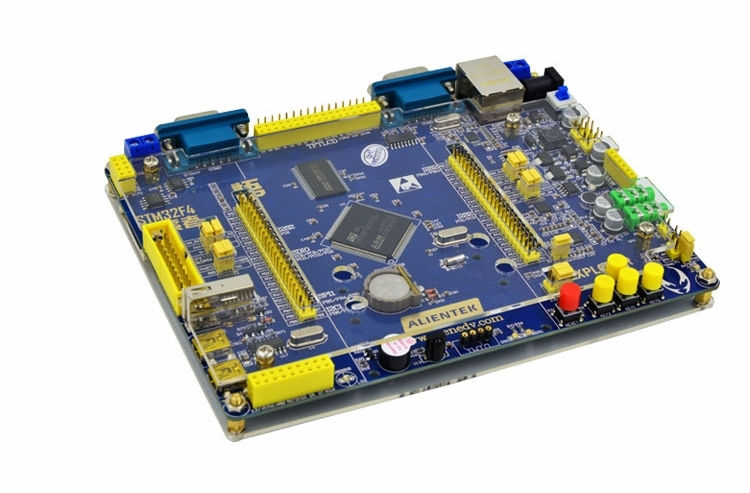
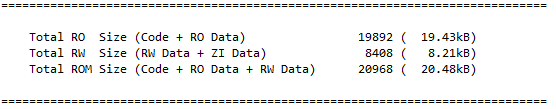
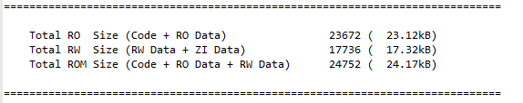
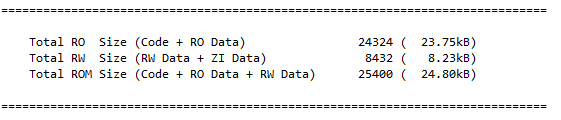
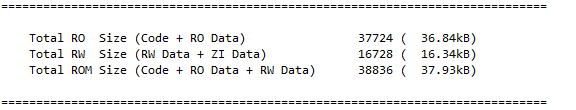
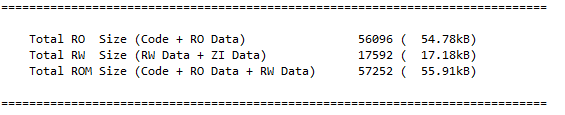
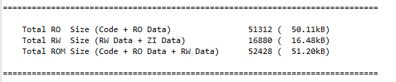

# Agile Upgrade MCU Demos

## 1、介绍

1. 该仓库为 [Agile Upgrade](https://github.com/loogg/agile_upgrade) 在 MCU 上实现 `Bootloader` 的例子
2. 示例多样化，极简到复杂
3. 基于 `RT-Thread 4.1.0` 版本
4. 基于正点原子探索者开发板

  

- 目录结构

  | 名称 | 说明 |
  | ---- | ---- |
  | FalBoot | 使用 fal 的 Bootloader |
  | figures | 素材 |
  | MinimalistBoot | 极简 Bootloader |
  | RTT_Template | RT-Thread 完整版示例工程 |
  | tools | 打包工具 |

## 2、Bootloader

一般 `Bootloader` 实现的逻辑如下：

  

这种方式适合于简单的裸机程序或可控的 OS 程序（即所有外设硬件都可把控），在准备环境的时候将其全部关闭。

但对于一些复杂的或者 OS 中轮子已造好的程序，有一些因素不花时间研究无法把控，在准备环境时很可能就会遗漏一些未关闭导致出各种各样的问题。

这里提供一种 **万能** 方法：

```C
- 利用芯片中的不受软件复位影响的可供用户使用的寄存器 (如 STM32 中的备份寄存器)。
- 在需要跳入 APP 运行时将该寄存器赋值然后软件复位。
- 在 OS 还没初始化时判断该寄存器值，如果需要跳转只需要简单的准备环境即可跳转。
```

  

该方法可以使 `Bootloader` 就作为一个 OS 应用程序开发，需要跳转的时候就操作一下寄存器并软件复位即可。

该仓库下所有的 `Bootloader` 例子均使用此方法。

以正点原子探索者开发板的 `STM32F4` 为例，将 `system_stm32f4xx.c` 文件的 `SystemInit` 函数修改：

```C
void boot_start_application(void);
void SystemInit(void)
{
  boot_start_application();

  ...
}
```

`boot_start_application` 的实现为：

```C
typedef void (*boot_app_func)(void);
void boot_start_application(void) {
    __HAL_RCC_PWR_CLK_ENABLE();
    HAL_PWR_EnableBkUpAccess();

    RTC_HandleTypeDef RTC_Handler = {0};
    RTC_Handler.Instance = RTC;
    uint32_t bkp_data = HAL_RTCEx_BKUPRead(&RTC_Handler, BOOT_BKP);
    HAL_RTCEx_BKUPWrite(&RTC_Handler, BOOT_BKP, 0);

    if (bkp_data != 0xA5A5) return;

    boot_app_func app_func = NULL;
    uint32_t app_addr = BOOT_APP_ADDR;
    if (((*(__IO uint32_t *)(app_addr + 4)) & 0xff000000) != 0x08000000) return;

    /* 栈顶地址在 128K RAM 间 */
    if (((*(__IO uint32_t *)app_addr) - 0x20000000) >= (STM32_SRAM_SIZE * 1024)) return;

    app_func = (boot_app_func) * (__IO uint32_t *)(app_addr + 4);
    /* Configure main stack */
    __set_MSP(*(__IO uint32_t *)app_addr);
    /* jump to application */
    app_func();
}
```

设置寄存器并软件复位的实现为：

```C
static void boot_app_enable(void) {
    __disable_irq();
    RTC_HandleTypeDef RTC_Handler = {0};
    RTC_Handler.Instance = RTC;
    HAL_RTCEx_BKUPWrite(&RTC_Handler, BOOT_BKP, 0xA5A5);
    HAL_NVIC_SystemReset();
}
```

## 3、RT-Thread 完整版、RT-Thread Nano 及裸机对比

### 3.1、RTOS 与裸机

很多人都会觉得裸机开发比 RTOS 简单并且编译出来的空间小的多，但以我的开发经验来说并非如此。

1. 开发难易程度

    - 裸机

      裸机开发经常使用的是前后台框架，一个有多步执行操作的 `task` 基本上都是使用 `switch case` 方式。

      一级延时很好处理只需要改变 `task` 的再一次进入时间即可。

      嵌套延时则需要加状态位并在函数中嵌套 `switch case`，程序非常臃肿。

    - RTOS

      RTOS 中多步操作只需按顺序调用函数即可，挂起也只需调用系统提供的 API ，代码精简且逻辑清晰。

2. 资源占用

    以 `RT-Thread Nano` 举例，官方给出的数据如下：

    ```C
    在运行两个线程 (main 线程 + idle 线程) 情况下，ROM 和 RAM 依然保持着极小的尺寸。
    以下是基于 Cortex M3 的 MDK 工程编译结果 (优化等级 3)

    Total RO  Size (Code + RO Data)                 4000 (   3.91kB)
    Total RW  Size (RW Data + ZI Data)              1168 (   1.14kB)
    Total ROM Size (Code + RO Data + RW Data)       4092 (   4.00kB)
    ```

    从数据中可以得知资源占用并没有相差非常大。

### 3.2、RT-Thread 完整版与 RT-Thread Nano

许多人对于这两个的争议在于：`RT-Thread 完整版` 资源占用太大，小芯片用不了等等。

这里我就用事实来证明并非如此，完全可以裁剪到 `Nano` 一样的大小，并且 `RT-Thread 完整版` 还支持 `menuconfig` 不需要自己添加代码文件，真香。

同时 `RT-Thread` 还有许多纯 C 语言的不涉及硬件的软件包，使用 `menuconfig` 拿来即用，真香。

这里我以正点原子探索者开发板 `bsp` 为例，基于 `RT-Thread v4.1.0` 版本，具体工程查看 [RTT_Template](./RTT_Template)。

- `CubeMX` 生成的 MDK 工程编译结果 (优化等级 0)

  ```C
  Total RO  Size (Code + RO Data)                 8120 (   7.93kB)
  Total RW  Size (RW Data + ZI Data)              1832 (   1.79kB)
  Total ROM Size (Code + RO Data + RW Data)       8136 (   7.95kB)
  ```

- 在运行两个线程 (main 线程 + idle 线程) 情况下的 MDK 工程编译结果 (优化等级 0), 适配了 `rt_hw_console_output`

  ```C
  Total RO  Size (Code + RO Data)                13256 (  12.95kB)
  Total RW  Size (RW Data + ZI Data)              3136 (   3.06kB)
  Total ROM Size (Code + RO Data + RW Data)      13396 (  13.08kB)
  ```

- 两者比较差值

  ```C
  Total RO  Size (Code + RO Data)                 5136 (   5.02kB)
  Total RW  Size (RW Data + ZI Data)              1304 (   1.28kB)
  Total ROM Size (Code + RO Data + RW Data)       5260 (   5.14kB)
  ```

从上述数据可以得出结论：`RT-Thread 完整版` 通过裁剪可以完全媲美 `RT-Thread Nano`，所以首选 `RT-Thread 完整版`。

## 4、Bootloader 工程使用

[tools](./tools) 文件夹下包含了固件打包工具和应用层固件 `app.bin`，起始地址为 `0x08080000`。

应用层分区如下：

| name | flash_dev | offset | length |
| --- | --- | --- | --- |
| download_w25q   | W25Q128           | 0x00000000 | 0x00060000 |
| download_onchip | onchip_flash_128k | 0x00000000 | 0x00060000 |
| app             | onchip_flash_128k | 0x00060000 | 0x00060000 |

在应用程序中下载固件需要使用 `ymodem_ota -p [dst]` 命令，`[dst]` 为目标分区 `download_w25q` 或 `download_onchip`。

以下工程编译结果都是基于 `优化等级 0`。

### 4.1、MinimalistBoot 使用

该工程下提供 3 个配置文件，通过 `ENV` 工具的 `menuconfig` `Load` 配置并 `save` 为 **`.config`** 后执行 `scons --target=mdk5 -s` 即可生成工程。

该工程未使用动态内存分配，故编译结果即为真实内存使用。

配置文件分别为：`.config.minimal`、`.config.w25q_qlz` 和 `.config.shell_qlz`。

- `.config.minimal`

  极简 `Bootloader`，不支持压缩和加密类型固件，下载分区为 `download_onchip`。

  

- `.config.w25q_qlz`

  支持 `quicklz` 方式压缩的固件，下载分区为 `download_w25q`。

  

- `.config.shell_qlz`

  支持 `quicklz` 方式压缩的固件，升级失败可通过敲击键盘 `Enter` 键进入 `Shell`，下载分区为 `download_onchip`。

  

### 4.2、FalBoot 使用

该工程基于 `FAL` 组件，提供 4 个配置文件，通过 `ENV` 工具的 `menuconfig` `Load` 配置并 `save` 为 **`.config`** 后执行 `scons --target=mdk5 -s` 即可生成工程。

配置文件分别为：`.config.minimal`、`.config.dev_qlz`、`.config.w25q_dev_qlz` 和 `.config.shell_dev_qlz`。

- `.config.minimal`

  不支持压缩和加密类型固件，下载分区为 `download_onchip`。

  

- `.config.dev_qlz`

  使用了设备框架，支持 `quicklz` 方式压缩的固件，下载分区为 `download_onchip`。

  

- `.config.w25q_dev_qlz`

  使用了设备框架，支持 `quicklz` 方式压缩的固件，下载分区为 `download_w25q`。

  

- `.config.shell_dev_qlz`

  使用了设备框架，支持 `quicklz` 方式压缩的固件，升级失败可通过敲击键盘 `Enter` 键进入 `Shell`，下载分区为 `download_onchip`。

  
